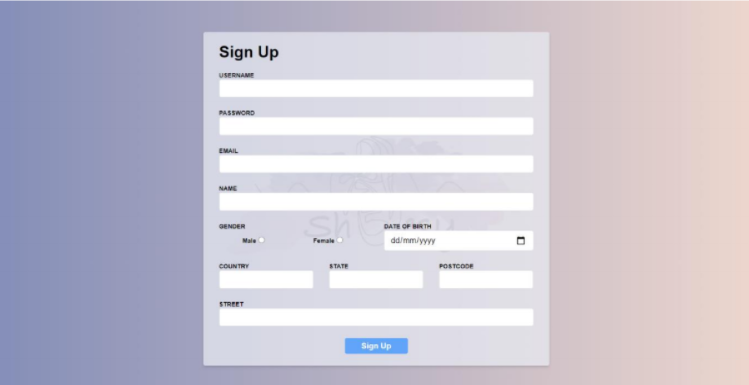
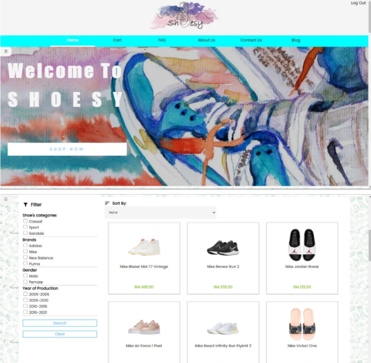
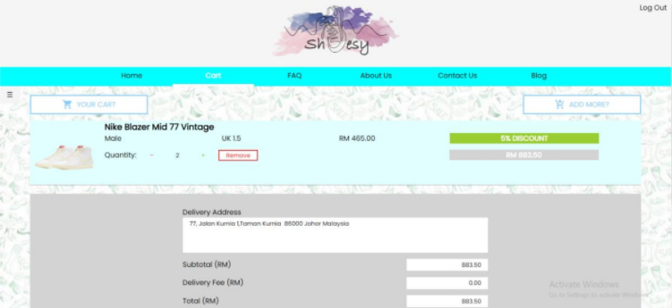
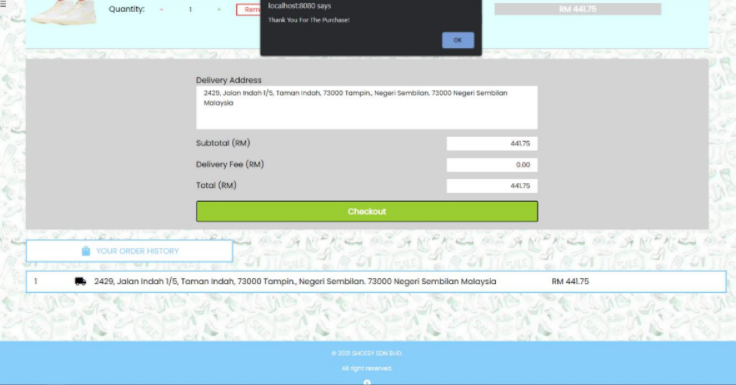
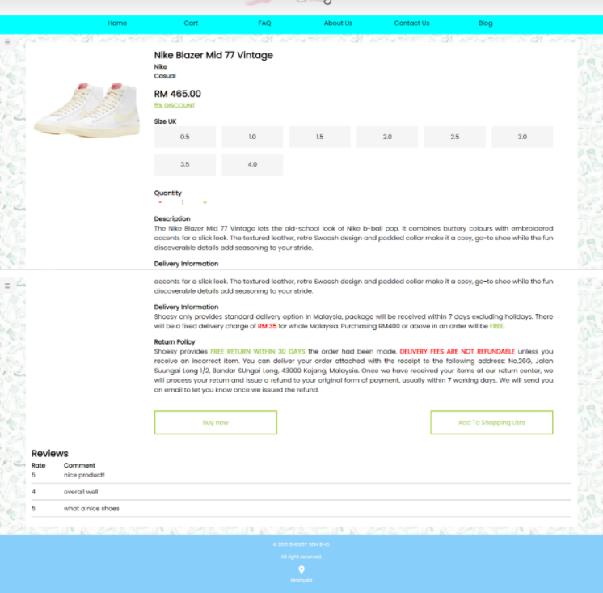
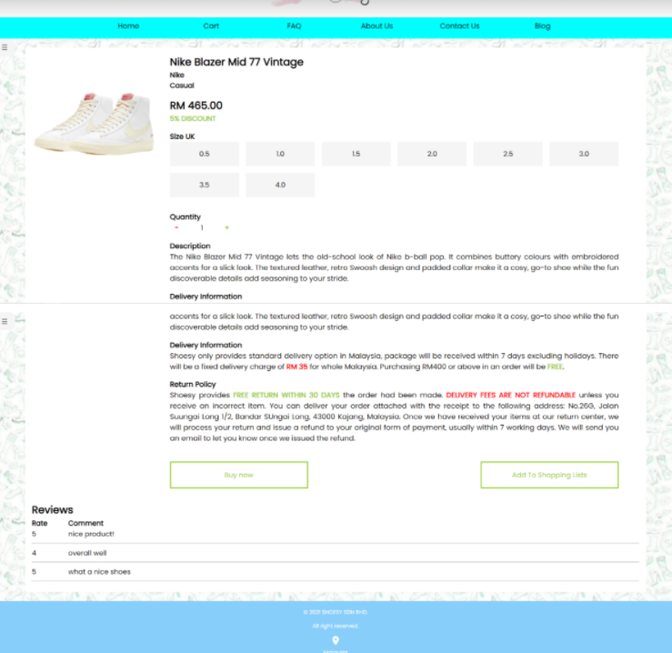
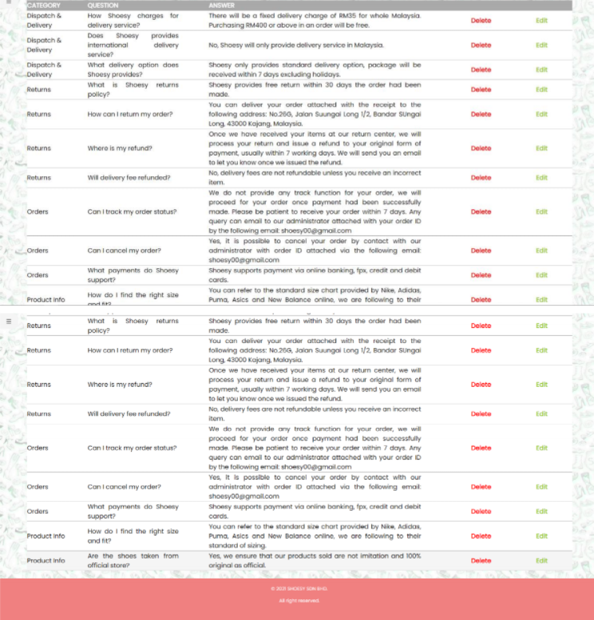
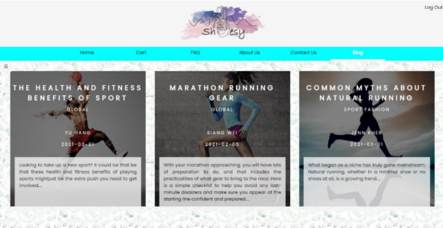
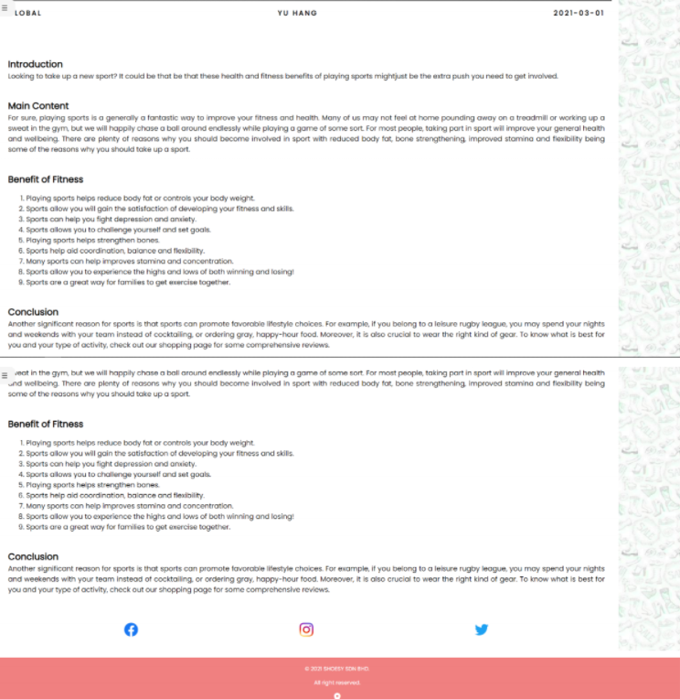

# Table of contents

- [Web Application Assignment](#web-application-assignment)
  - [- html, css, js, php, mysql](#--html-css-js-php-mysql)
  - [Project Description](#project-description)
  - [Dependencies](#dependencies)
  - [Screenshots](#screenshots)

# Web Application Assignment

A group assignments that aims to learn and understand:

- html, css, js, php, mysql
- web server setup
- full stack development

## Project Description

A Online Shoes Selling Website built using php as backend language. 

Function:

- admin and member accounts (login, signup)
- member function (cart, checkout, view item, review purchases)
- admin function (item, faq, blog)

## Dependencies

- php 
- MySql 

## Screenshots

